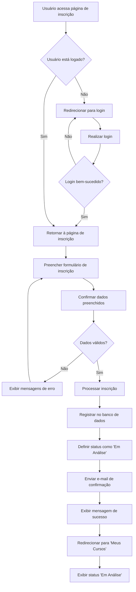
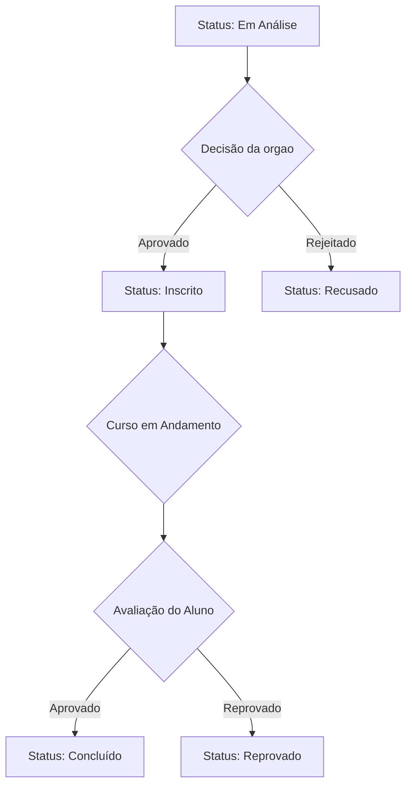
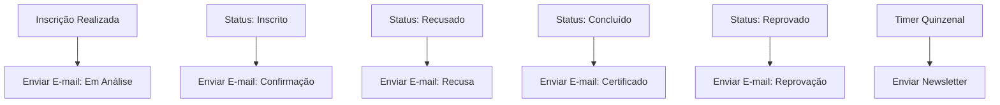

# Fluxograma do Sistema de Inscrições - Ciclo Carioca

## Fluxo Principal de Inscrição



### Mensagem de Sucesso Inicial
**"Inscrição enviada com sucesso! Fique de olho no seu e-mail ou acompanhe o andamento da sua solicitação diretamente na seção 'Meus cursos' aqui no Ciclo Carioca."**

## Sistema de Status das Inscrições



### Mensagens por Status

#### 🔍 **Em Análise**
*"Sua inscrição foi enviada e será avaliada pelo orgao responsável. Você receberá um e-mail com mais informações em breve."*

#### ✅ **Inscrito**
*"Sua inscrição foi aprovada com sucesso. Você já está confirmado(a) no curso e receberá por e-mail mais informações sobre as próximas etapas."*

#### 🎓 **Concluído**
*"Parabéns! Você concluiu o curso. O certificado já está disponível e pode ser acessado diretamente pelo botão abaixo."*

#### ❌ **Recusado**
*"Sua inscrição foi analisada, mas não foi aprovada desta vez. Isso pode ter acontecido por não ter cumprido algum dos requisitos ou critérios definidos pela instituição responsável. Você pode tentar se inscrever novamente em uma próxima oportunidade ou conferir outros cursos disponíveis no Ciclo Carioca."*

#### ❌ **Reprovado**
*"Infelizmente você não atingiu os critérios necessários para a aprovação neste curso. Mas não desanime! Fique de olho em novas turmas ou em outros cursos que possam te interessar."*

## Sistema de Disparos de E-mail



### Templates de E-mail por Status

#### 📧 **E-mail: Inscrição Em Análise**
**Assunto:** Inscrição recebida - [Nome do Curso]
```
Olá [Nome do Usuário],

Sua inscrição foi enviada e será avaliada pelo órgão responsável. 
Você receberá um e-mail com mais informações em breve.

Você também pode acompanhar o status da sua inscrição na seção "Meus Cursos" 
no Ciclo Carioca.

Atenciosamente,
Equipe Ciclo Carioca
```

#### 📧 **E-mail: Inscrição Confirmada**
**Assunto:** Parabéns! Sua inscrição foi aprovada - [Nome do Curso]
```
Olá [Nome do Usuário],

Sua inscrição foi aprovada com sucesso! Você já está confirmado(a) no curso 
[Nome do Curso].

Em breve você receberá mais informações sobre as próximas etapas, incluindo:
- Data de início
- Local ou link de acesso
- Materiais necessários
- Instruções específicas

Atenciosamente,
Equipe Ciclo Carioca
```

#### 📧 **E-mail: Inscrição Recusada**
**Assunto:** Informações sobre sua inscrição - [Nome do Curso]
```
Olá [Nome do Usuário],

Sua inscrição foi analisada, mas não foi aprovada desta vez. Isso pode ter 
acontecido por não ter cumprido algum dos requisitos ou critérios definidos 
pelo órgão responsável.

Você pode:
- Tentar se inscrever novamente em uma próxima oportunidade
- Conferir outros cursos disponíveis no Ciclo Carioca

Atenciosamente,
Equipe Ciclo Carioca
```

#### 📧 **E-mail: Curso Concluído**
**Assunto:** Parabéns! Certificado disponível - [Nome do Curso]
```
Olá [Nome do Usuário],

Parabéns! Você concluiu o curso [Nome do Curso] com sucesso!

Seu certificado já está disponível e pode ser acessado através do seu 
perfil na seção "Meus Cursos" no Ciclo Carioca.

[Botão: Baixar Certificado]

Atenciosamente,
Equipe Ciclo Carioca
```

#### 📧 **E-mail: Reprovação no Curso**
**Assunto:** Informações sobre o curso [Nome do Curso]
```
Olá [Nome do Usuário],

Infelizmente você não atingiu os critérios necessários para a aprovação 
no curso [Nome do Curso]. 

Mas não desanime! Fique de olho em:
- Novas turmas deste curso
- Outros cursos que possam te interessar

Continue aprendendo conosco!

Atenciosamente,
Equipe Ciclo Carioca
```

#### 📧 **Newsletter Quinzenal**
**Assunto:** Novas oportunidades de cursos - Ciclo Carioca
```
Olá [Nome do Usuário],

Confira as novas oportunidades de cursos disponíveis no Ciclo Carioca:

[Lista de novos cursos com links]

Não perca essas oportunidades de desenvolvimento!

[Botão: Ver Todos os Cursos]

Para cancelar o recebimento destes e-mails, [clique aqui].

Atenciosamente,
Equipe Ciclo Carioca
```

## Configurações Técnicas

### Triggers para Disparos de E-mail
- **Em Análise**: Imediatamente após confirmação da inscrição
- **Inscrito**: Quando administrador aprovar a inscrição
- **Recusado**: Quando administrador recusar a inscrição
- **Concluído**: Quando curso for marcado como finalizado pelo usuário/administrador
- **Reprovado**: Quando avaliação final for menor que nota mínima
- **Newsletter**: A cada 15 dias (configurável)

### Variáveis dos Templates
- `[Nome do Usuário]`: Nome completo do usuário
- `[Nome do Curso]`: Título completo do curso
- `[Data de Início]`: Data prevista para início do curso
- `[Local/Link]`: Endereço físico ou link de acesso online
